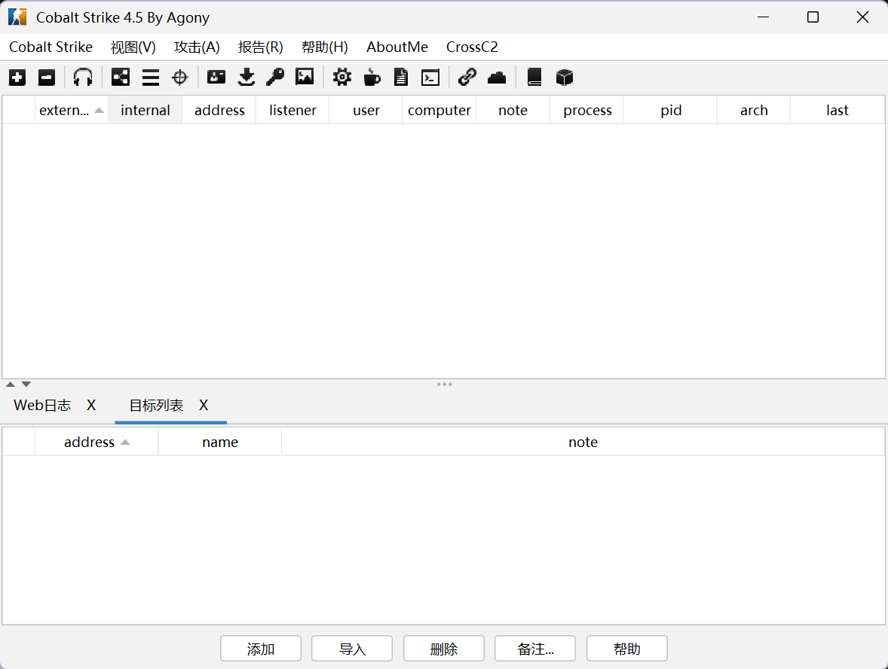

# CobaltStrike4.5 - 魔改版 - Agony

​																											

## 介绍

Agony自用CS，根据CobaltStrike4.5二次开发，修复若干个bug


## 更新日志

### v1.0版本

- 修改默认端口
- 修改默认ssl证书
- 修改profile文件
- 修复支持VNC
- 修改checksum8特征
- 修改监听不返回任何数据
- 防止stage被扫
- 去除listenerConfig特征字符串
- 修改配置加解密的xorkey
- cs去除beaconeye特征
- 修复CVE-2022-39197
- 修复错误路径泄漏stage
- 修复cs4.5的foreign派生bug
- 添加中文汉化翻译
- 去除listenerConfig特征字符串
- 修复session
- 修复target
- 修复文件浏览器
- 修复listeners
- session新增IP归属地显示
- Event Log 显示连接的 teamserver 的 IP
- 修改默认登录int长度48879

### v1.5版本

- 修复了上线慢的bug！
- 修改了图标和logo
- 修改了一些细节
- 增添了2种不同的profile文件
  - 一种是普通profile文件
  - 另一种是使用域前置的profile文件（请配置为你自己的域名使用）
- 增加了火绒6.0免杀的profile


## 使用

**环境**

- 确保你使用 java 11版本


**服务端：**

```
chmod +x teamserver
./teamserver 你的vps 密码 agony.profile
```

vps记得开放端口

**客户端：**

- 直接双击CS4.5_agony.vbs启动客户端


